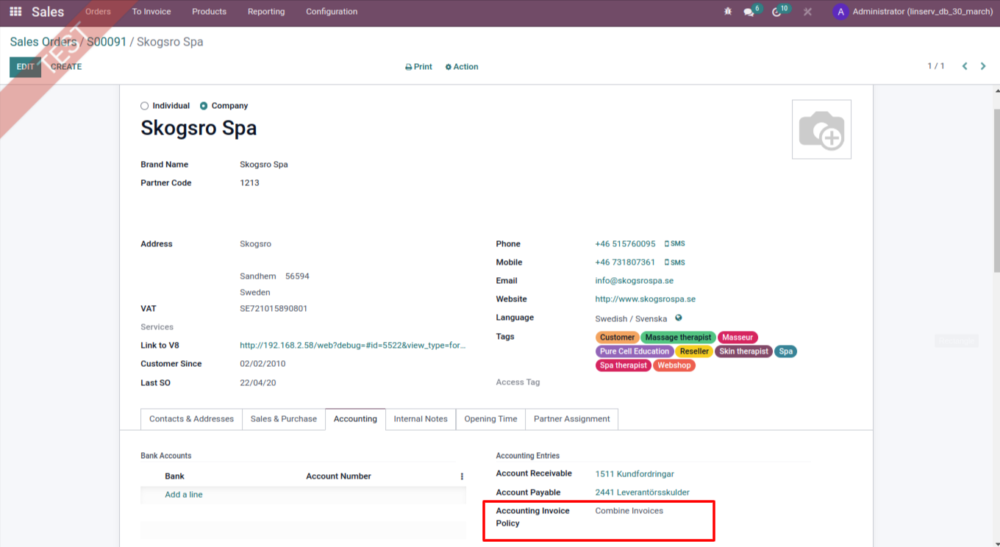
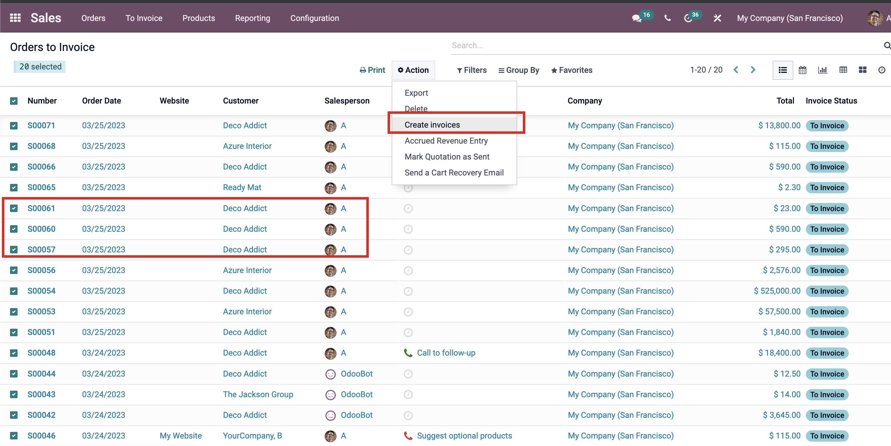

Accounting Invoice Policy
============================

Installation
============

Configuration
=============

DESCRIPTION
===========
Added New Feature to Create Invoice on Selection Basis.

PURPOSE
=======
To Create Invoice On Accounting Invoice Policy

Usage
=====

1. To Create Invoice on Selecion Basis Like Allow Combined Invoices/ Never Combine Invoices/ Split Invoice per VAT Basis.

   
   

Changelog
======================
- 15.0.1: To Create Invoice on Selecion Basis Like Allow Combined Invoices/ Never Combine Invoices/ Split Invoice per VAT Basis.

Contributors
------------

*  Sujeet Butani <sujeet.butani@linserv.se>

Do not contact contributors directly about support or help with technical issues.

Funders
-------

The development of this module has been financially supported by:

* Linserv Consulting AB

Maintainer
----------

.. image:: https://www.linserv.se/logo.png
   :alt: Linserv Consulting AB
   :target: https://www.linserv.se

This module is maintained by Linserv AB.

To contribute to this module, please visit https://www.linserv.se
